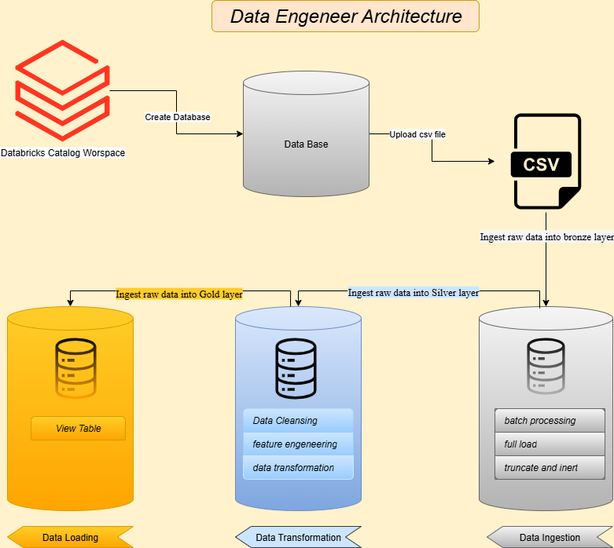
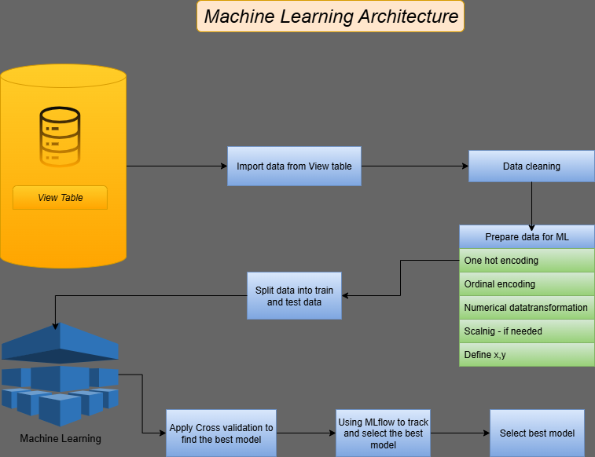
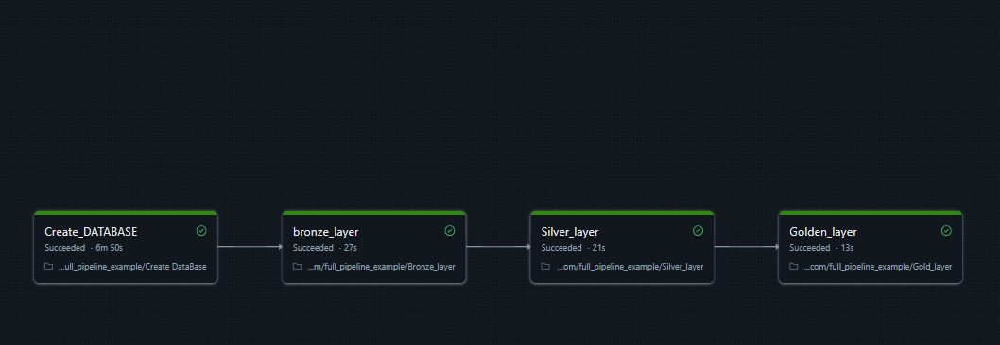

# DataBricks_DE-ML_Project.

## *Simple Data Engeneer and Machine Learing using Databricks Community verion*

## *👩‍💻 I'm currently working on...*

### *Welcome to the Data Engeneer and Machine Learing Project repository!  -using Databricks Community verion-🚀*

*This project apply Simple Data Engeneer and Machine Learing, Using SQL and Python to generate actionable insights. Designed as a portfolio project, it highlights industry best practices in data engineering and analytics.*

*Then will apply Machine learning Using Python to generate Predcited model by selcted the best one among diffirent ML Algorithms and tarck the experiences uding MLflow*

----------

*Data Engeneer Architecture :*

* *Raw Data : the raw data is ingsted in csv form into Databrisk Catalog workspace.*

*A. create a DATABASE.*

*B. Bronze Layer: Stores raw data as-is from the source systems.*

*C. Silver Layer: This layer includes data cleansing,feature engeneering and data transformation.*

*D. Gold Layer: The Final data -In View Table- Ready for reporting ,analytics and Machine Laerning.*

----------

*Machine Leraning Architecture :*

*In this section we will use python programming langauge and specificly Pyspark,Pandas,Sklearn.*

*As we are using Databricks Community verion we will use Pyspark in reading the data and do some necessery data cleaning, then will switch into Pandas and Sklearn since the Databricks Community verion doesnt support Some Pyspark features for ML like SringIndexer and VectorAssembler.*

*Then wil use MLflow to track models and find the best one.*

----------

*Data Engeneer Diagram :*

----------

*Machine Leraning Diagram :*

------------

*Data Engeneering Job Pipeline Created On Databricks:*

## *Feedback*

*If you have any feedback, please reach out to us at omars.soub@gmail.com*

## 🔗 Links

[*my github page-https://github.com/omars1234*](https://github.com/omars1234)

## *🛠 Skills*
*python, R, SQL ,PowerBi ,Tableaue*
